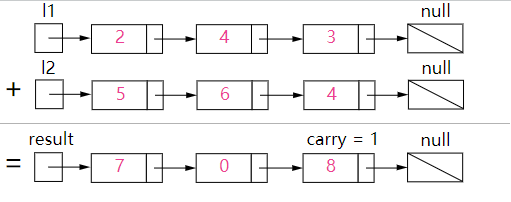

# 0002、add_two_number

## 1、题目描述

```
给出两个 非空 的链表用来表示两个非负的整数。其中，它们各自的位数是按照 逆序 的方式存储的，并且它们的每个节点只能存储 一位 数字。

如果，我们将这两个数相加起来，则会返回一个新的链表来表示它们的和。

您可以假设除了数字 0 之外，这两个数都不会以 0 开头。
```

## 2、示例

```
输入：(2 -> 4 -> 3) + (5 -> 6 -> 4)
输出：7 -> 0 -> 8
原因：342 + 465 = 807
```

## 3、解答思路

方法：初等数学

### 3.1 思路

我们使用变量来跟踪进位，并从包含最低有效位的表头开始模拟逐位相加的过程。

图示：



*图1，对两数相加方法的可视化： 342 + 465 = 807 ， 每个结点都包含一个数字，并且数字按位逆序存储。*


### 3.2 算法

就像你在纸上计算两个数字的和那样，我们首先从最低有效位也就是列表 l1 和 l2 的表头开始相加。由于每位数字都应当处于 0 - 9 的范围内，我们计算两个数字的和时可能会出现“溢出”。例如，5 + 7 = 12。在这种情况下，我们会将当前位的数值设置为 2，并将进位 carry = 1 带入下一次迭代。进位 carry 必定是 0 或 1，这是因为两个数字相加（考虑到进位）可能出现的最大和为 9 + 9 + 1 = 19。


伪代码如下：

- 将当前结点初始化为返回列表的哑结点。
- 将进位 carry 初始化为 0。
- 将 p 和 q 分别初始化为列表 l1 和 l2 的头部。
- 遍历列表 l1  和 l2 直至到达它们的尾端。
  - 将 x 设为结点 p 的值。如果 p 已经到达 l1 的末尾，则将其值设置为 0。
  - 将 y 设为结点 q 的值。如果 q 已经到达 l2 的末尾，则将其值设置为 0。
  - 设定 sum = x + y + carry。
  - 更新进位的值，carry = sum / 10。
  - 创建一个数值为 (sum mod 10) 的新结点，并将其设置为当前结点的下一个结点，然后将当前结点前进到下一个结点。
  - 同时，将 p 和 q 前进到下一个结点。
- 检查 carry = 1 是否成立，如果成立，则向返回列表追加一个含有数字 11 的新结点。
- 返回哑结点的下一个结点。

请注意，我们使用哑结点来简化代码。如果没有哑结点，则必须编写额外的条件语句来初始化表头的值。

请特别注意以下3种情况：

| 测试用例      | 说明 |
| ------------ | --- |
| l1 = [0,1]   | |
| l2 = [0,1,2] | 当一个列表比另一个列表长时。                   |
| l1 = []      | |
| l2 = [0,1]   | 当一个列表为空时，即出现空列表。                |
| l1 = [9,9]   | |
| l2 = [1]     | 求和运算最后可能出现额外的进位，这一点很容易被遗忘 |

## 4、代码示例

### 4.1 Python3

```python
# Definition for singly-linked list.
class ListNode(object):
    def __init__(self, x):
        self.val = x
        self.next = None

class Solution(object):
    def addTwoNumbers(self, l1, l2):
        """
        :type l1: ListNode
        :type l2: ListNode
        :rtype: ListNode
        """
        carry = 0
        tail = head = None
        while True:
            if not l1 and not l2:
                break
            
            if not l1:
                val1 = 0
            else:
                val1 = l1.val
                l1 = l1.next
            if not l2:
                val2 = 0
            else:
                val2 = l2.val
                l2 = l2.next
            
            if carry+val1+val2>=10:
                val = (carry+val1+val2)%10
                carry = 1
            else:
                val = (carry+val1+val2)
                carry = 0
                
                
            node = ListNode(val)
            if not head:
                head = tail = node
            else:
                tail.next = node
                tail = node
                
        if carry:
            node = ListNode(1)
            tail.next = node
            tail = node
        tail.next = None
        
        return head
```


### 4.2 官网提供的参考解答Java

```java
public ListNode addTwoNumbers(ListNode l1, ListNode l2) {
    ListNode dummyHead = new ListNode(0);
    ListNode p = l1, q = l2, curr = dummyHead;
    int carry = 0;
    while (p != null || q != null) {
        int x = (p != null) ? p.val : 0;
        int y = (q != null) ? q.val : 0;
        int sum = carry + x + y;
        carry = sum / 10;
        curr.next = new ListNode(sum % 10);
        curr = curr.next;
        if (p != null) p = p.next;
        if (q != null) q = q.next;
    }
    if (carry > 0) {
        curr.next = new ListNode(carry);
    }
    return dummyHead.next;
}
```

### 4.3 五分钟学算法提供的Java代码

```java
class Solution{
    Public:
    ListNode* addTwoNumbers(ListNode* l1, ListNode* l2){

        ListNode *p1 = l1, *p2 = l2;
        ListNode *dummyHead = new ListNode(-1);
        ListNode* cur = dummyHead;
        int carried = 0;
        while(p1 || p2){
            int a = p1 ? p1->val : 0;
            int b = p2 ? p2->val : 0;
            cur->next = new ListNode((a + b + carried) % 10);
            carried = (a + b + carried) / 10;

            cur = cur->next;
            p1 = p1 ? p1->next : NULL;
            p2 = p2 ? p2->next : NULL;    
        }

        cur->next = carried ? new ListNode(1) : NULL;
        ListNode *ret = dummyHead->next;
        delete dummyHead;
        return ret;
    }
};
```

## 5、复杂度分析

- 时间复杂度：O(max(m,n))，假设 m 和 n 分别表示 l1 和 l2 的长度，上面的算法最多重复 max(m,n) 次。
- 空间复杂度：O(max(m,n))， 新列表的长度最多为 max(m,n)+1。

## 6、拓展

如果链表中的数字不是按逆序存储的呢？例如：

(3→4→2)+(4→6→5)=8→0→7